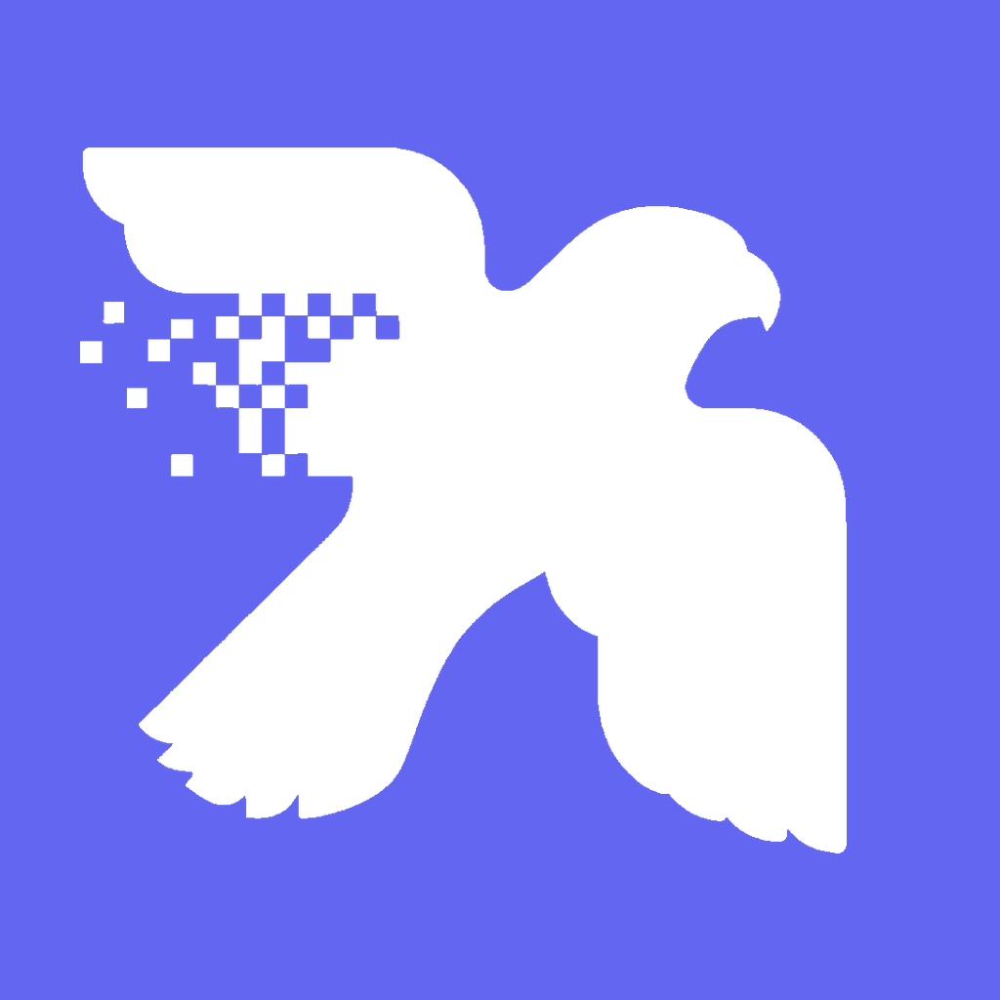

# Alotno

**Convert PNG to SVG, PDF, EPS, DXF, and WebP — fast, local, and private.**

[alotno.app](https://alotno.app)

---

## What is Alotno?

Alotno turns raster **PNG** images into clean vector files and optimized image
formats — right on your device. Drop in your PNGs, choose the formats you want,
convert. Nothing is uploaded; everything runs locally.

- **Vector out:** SVG (vector trace), PDF, EPS, DXF
- **Raster out:** WebP — lossy or **lossless**, color or mono
- **Batch:** drop many PNGs and convert them all at once
- **Private by design:** 100% on-device — your images never leave your machine
- **Native & fast:** real desktop app, not a webpage in a wrapper
- **Everywhere:** macOS today; web, Windows, Linux, iOS & Android next

## The logo

A falcon whose wing dissolves from **pixels into vector line-art** — a visual pun
on exactly what Alotno does: PNG → SVG. The mark uses the brand indigo and ships
in several formats in [`design/brand/`](design/brand).

## Get it

- **macOS** — a signed & notarized `.dmg` you can run on any Mac (built with
  [`scripts/release-macos.sh`](scripts/release-macos.sh)).
- **Web** — [alotno.app](https://alotno.app): convert right in the browser, no install.

## Under the hood

One conversion engine, written once in **Rust**, compiled to **WebAssembly** for
the web and to a **native library** for the apps — paired with a single design
system so every platform looks and behaves identically. The architecture *is* the
point of this project.

Technical docs:

- [Architecture](docs/architecture.md) — how one engine serves every platform
- [Feature support](docs/features.md) — what each format/option does (and what's not supported)
- [Running locally](docs/running.md) — build & dev setup
- [Releasing (macOS)](docs/releasing-macos.md) — sign + notarize + DMG
- [Roadmap](docs/roadmap.md)
- [Design system](DESIGN.md) · [design tokens](design/README.md)

## License

[AGPL-3.0](LICENSE) © Maksym Shykov
